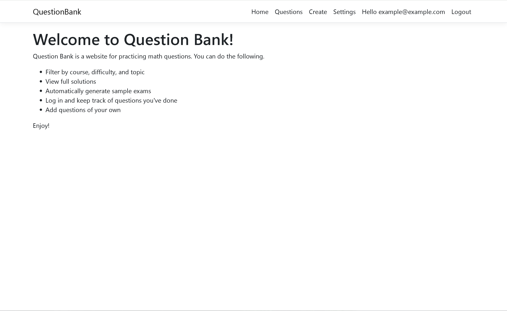
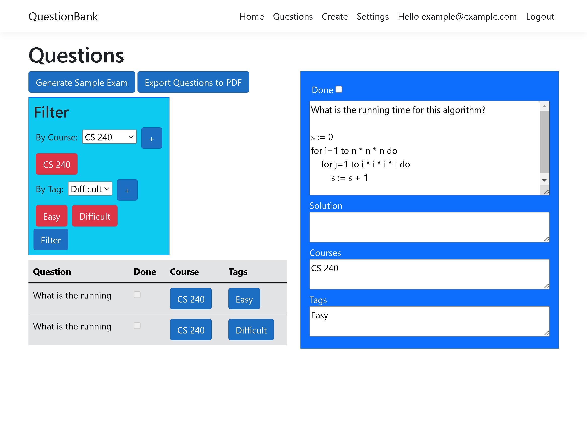
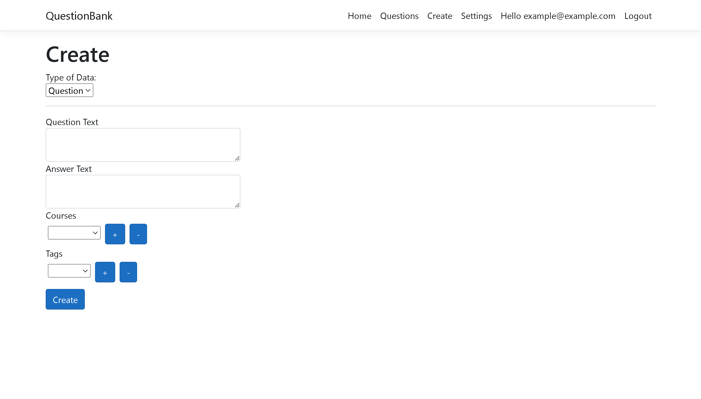
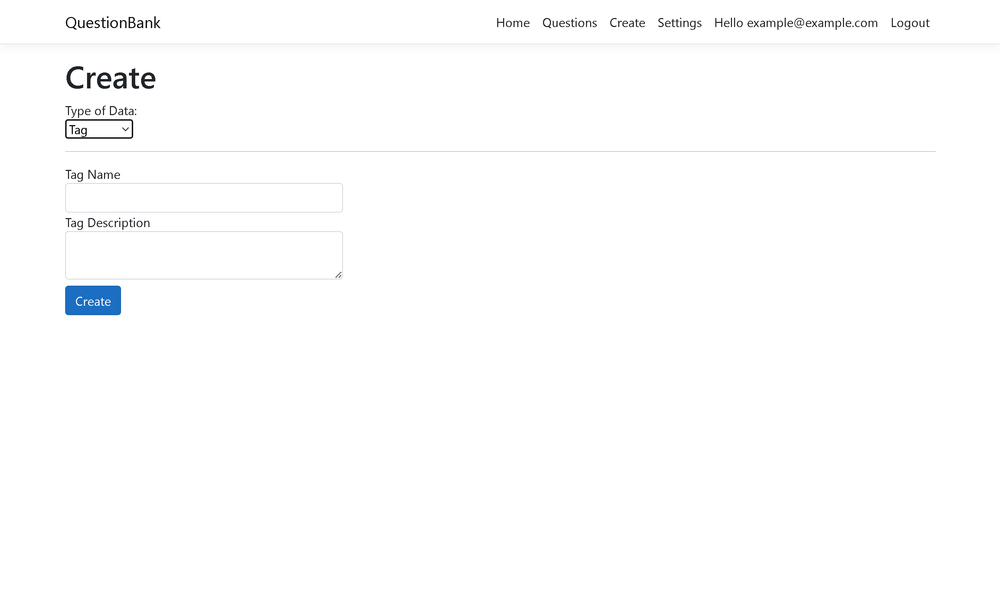
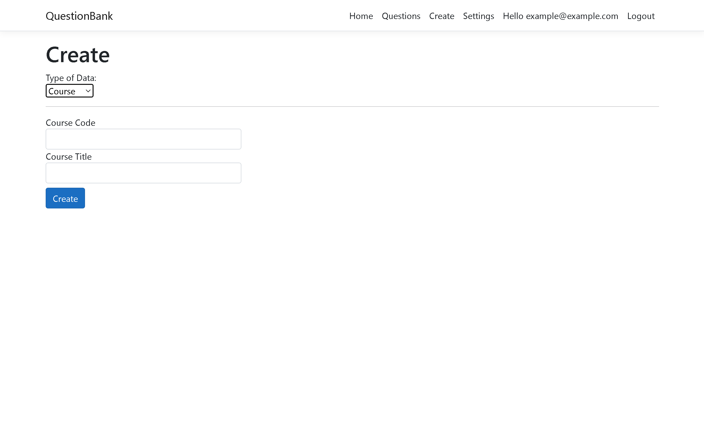

# Question Bank

A web app for organizing math questions in a tag-based system for studying purposes.

Technologies Used:

- C#, Entity Framework
- JavaScript, React
- Bootstrap

### Key Screenshots

